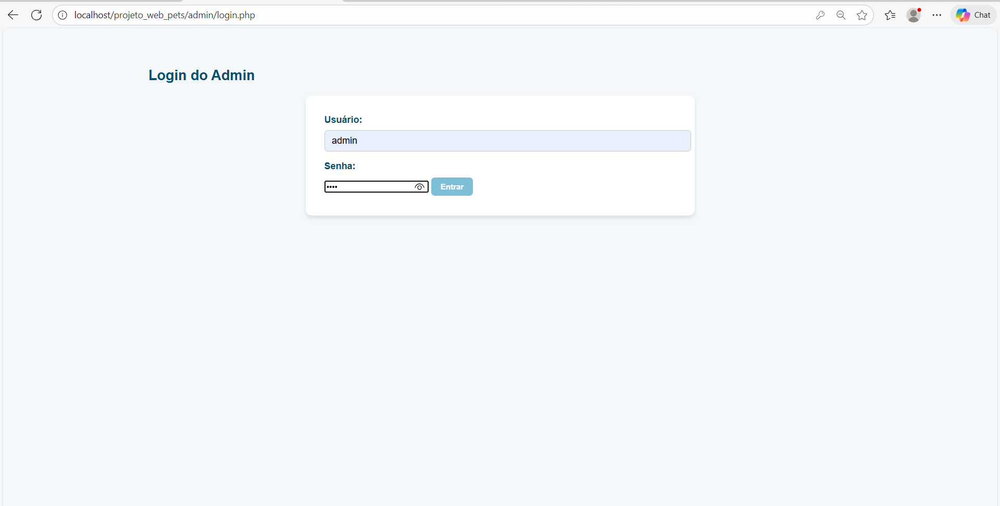
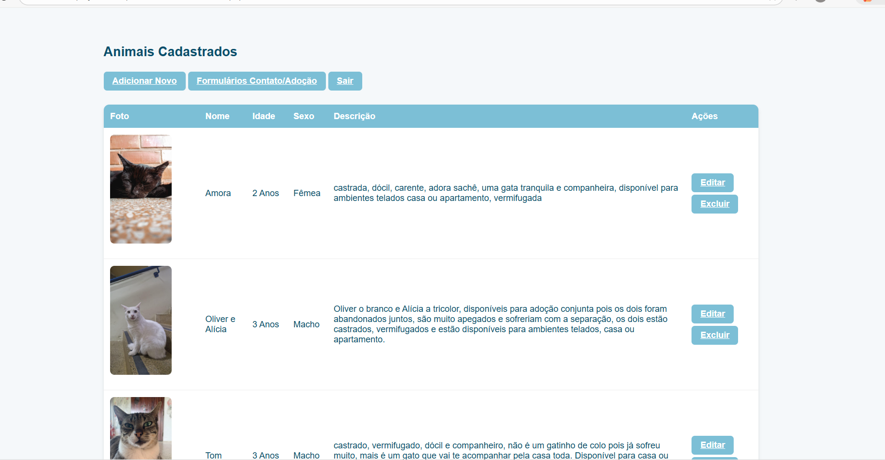
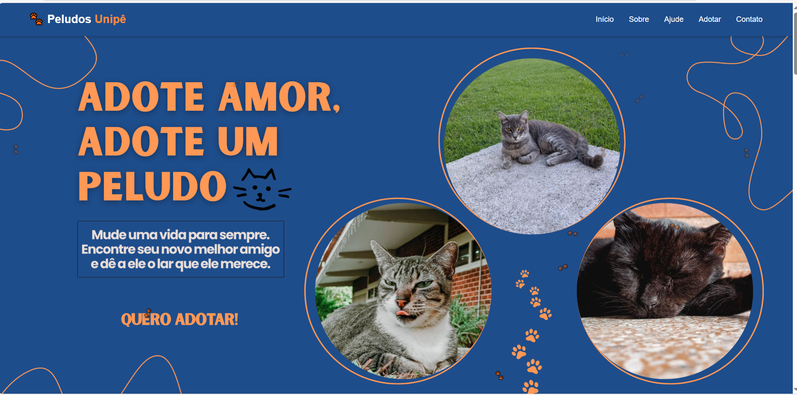
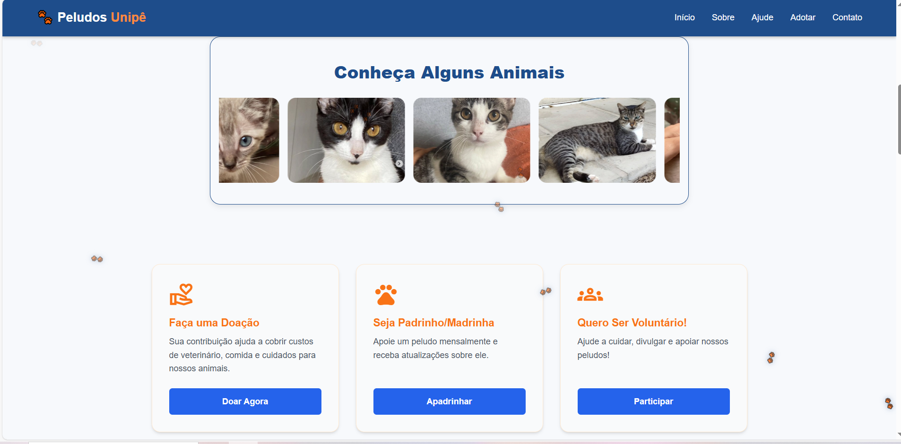
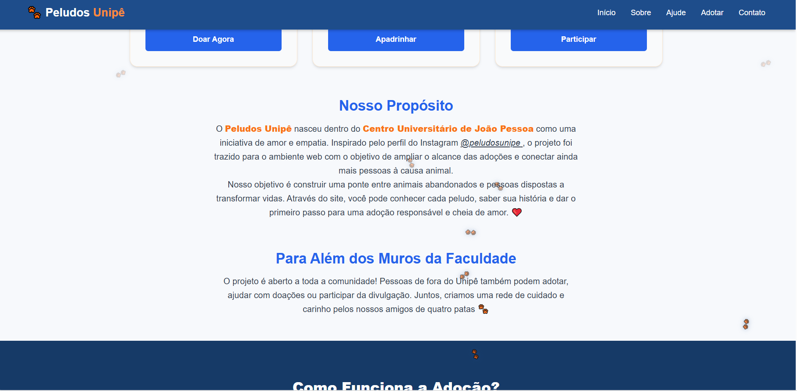
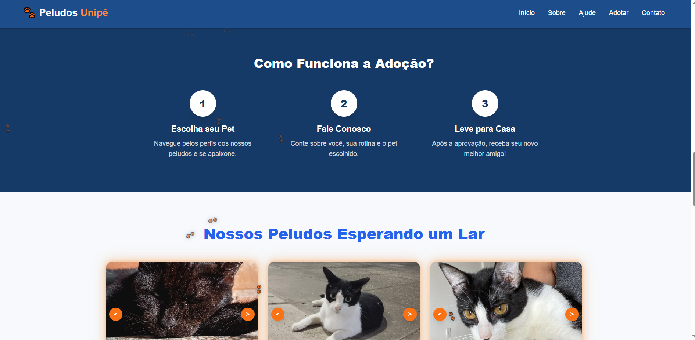
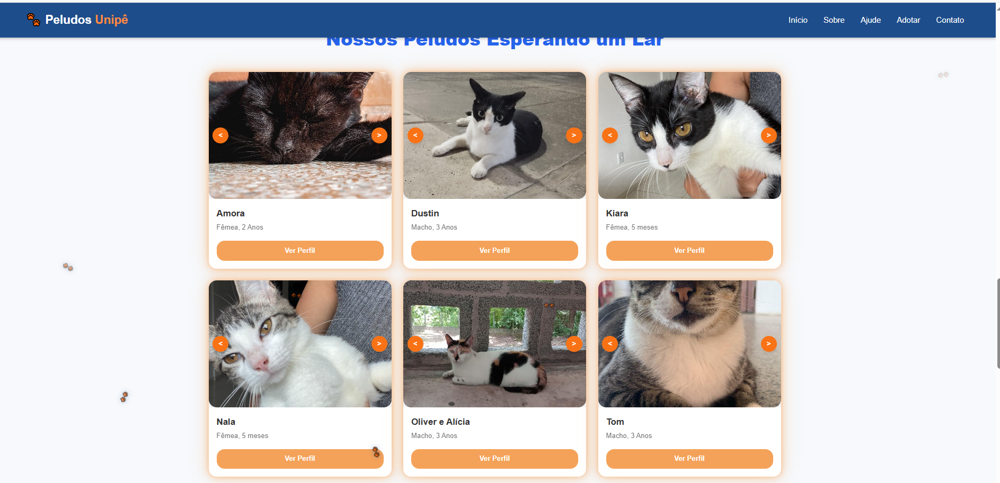
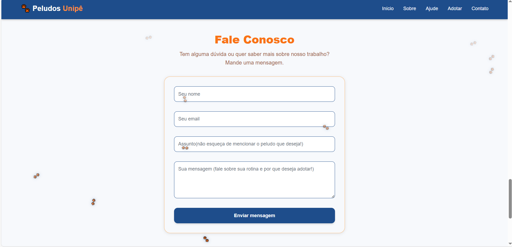
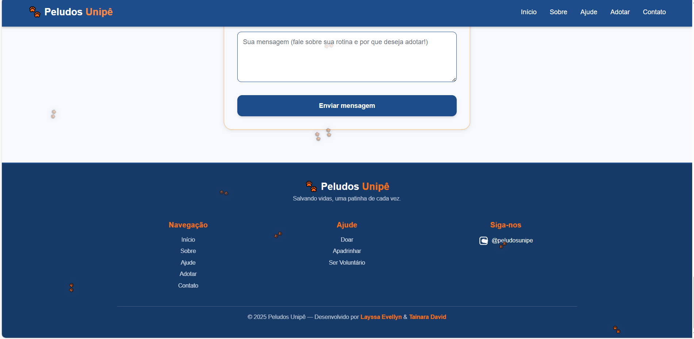

# 🐾 Projeto Web Pets -- Sistema de Adoção de Animais

Desenvolvido na por **Layssa Evellyn** e **Tainara David**

## 🎯 Objetivo do Projeto

O **Projeto Web Pets** consiste na criação de um sistema web para facilitar a adoção de animais abandonados ou resgatados no **Centro Universitário de João Pessoa (UNIPÊ)**.

A ideia surgiu a partir do perfil **@peludosunipe** no Instagram, que realiza um trabalho incrível na divulgação desses animais.  
O objetivo foi **expandir essa ação para uma plataforma web**, permitindo que qualquer pessoa tenha acesso às informações dos pets e possa demonstrar interesse em adotá-los.

### 📌 Funcionalidades Principais

- **CRUD de animais:** cadastrar, editar, excluir e listar pets.  
- **Campos do cadastro:** nome, idade, tipo (gato, cachorro, etc.), descrição e foto.  
- **Página pública:** exibe todos os animais cadastrados, com botão **“Quero adotar”**.  
- **Área administrativa:** gerenciamento completo dos pets e das solicitações de adoção.  
- **Banco de dados:** integração com **phpMyAdmin/MySQL**.  
- **Sistema totalmente responsivo:** funciona perfeitamente em celulares, tablets e desktops.  
- **Tecnologias utilizadas:** PHP, HTML, CSS, JavaScript, XAMPP e MySQL/phpMyAdmin.

### 🐶 Área Pública

-   Exibição de animais disponíveis para adoção\
-   Exibição de detalhes de cada pet\
-   Formulário para interessados solicitarem adoção

### 🔐 Área Administrativa

-   Cadastro, edição e exclusão de animais\
-   Upload e gerenciamento de fotos\
-   Visualização e gerenciamento de formulários de adoção\
-   Login e proteção de páginas por sessão

## 🗂️ Estrutura do Projeto

    projeto_web_pets-main/
    │
    ├── admin/
    ├── css/
    ├── img/
    ├── js/
    ├── uploads/
    ├── tabelas_adocao.sql
    ├── index.php
    └── README.md

## 📦 Instalação

1.  Clonar o repositório, importar `tabelas_adocao.sql` no phpMyAdmin\MySQL
2.  Configurar o ambiente XAMPP
3.  Executar o projeto via localhost `http://localhost/projeto_web_pets/pages/index.php`
   

## 👤 Acesso à Administração

`http://localhost/projeto_web_pets/admin/login.php`

Usuário padrão:

    admin / 1234

## 📖 Licença

Projeto de uso livre para estudos.

## 📷 Fotos do projeto

